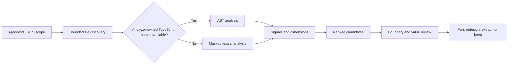

# Gleamability

> Evidence-led migration planning for JS/TS teams adopting Gleam.

[](https://skills.sh/phtn/gleamability/gleamability)
[](package.json)
[](package.json)
[](LICENSE)

**Rank the right modules. Review the real boundaries. Port only what earns the
move.**

[Install](#installation) ·
[How it works](#how-it-works) ·
[CLI reference](#cli-reference) ·
[Security](#security-model) ·
[Development](#development)

---

Gleamability is an agent skill and deterministic analyzer for finding worthwhile
[Gleam](https://gleam.run/) migration candidates in JavaScript and TypeScript
codebases. It combines static signals with a required human review of domain
value, runtime boundaries, and interoperability cost.

It does not treat “easy to translate” as “worth migrating.” The goal is a
small, defensible first port with a stable boundary—not a rewrite campaign.

## At a glance

| Capability | What it does | Why it matters |
| --- | --- | --- |
| Triage | Ranks eligible JS/TS modules | Starts with evidence |
| Boundaries | Finds host and framework coupling | Exposes port cost |
| Judgment | Distinguishes port, extract, or keep | Supports adoption |
| Planning | Defines APIs, types, and adapters | Enables execution |
| Inspection | Parses without executing modules | Preserves trust |

## Installation

Install the skill from GitHub:

```bash
npx skills add https://github.com/phtn/gleamability --skill gleamability
```

Then invoke it from a supported agent:

```text
Use $gleamability to scan this repository, review the top five candidates,
and recommend the safest first Gleam port.
```

You can narrow the request to a package, directory, or specific module:

```text
Use $gleamability on packages/domain/src. Rank whole-file and pure-core
extraction candidates, then sketch the highest-value port.
```

> [!NOTE]
> The analyzer ranks candidates; the skill workflow verifies them. A high
> score is triage evidence, not an automatic migration decision.

## How it works



The analyzer produces three dimensions:

| Dimension | Direction | Meaning |
| --- | --- | --- |
| `languageFit` | Higher is better | Type and control-flow fit |
| `boundaryCost` | Higher is worse | JS and host friction |
| `migrationValue` | Higher is better | Useful domain behavior |

The final score prioritizes promising logic while penalizing difficult
boundaries. Results are grouped as **Strong candidate**, **Possible
candidate**, **Low priority**, or **Not a fit**.

Manual review then corrects the heuristic by inspecting the candidate, its
callers, its tests, and its JavaScript-facing API. Each reviewed module receives
one of five practical verdicts:

1. Whole-file candidate
2. Port with redesign
3. Extract a pure core and keep orchestration in JavaScript or TypeScript
4. Keep in JavaScript or TypeScript
5. Already migrated or an interop adapter

## Direct analyzer usage

The committed CommonJS runtime can be used independently of an agent:

```bash
node ./scripts/analyze.cjs ./src \
  --top 15 \
  --json ./gleamability-report.json
```

Multiple files and directories may be scanned in one run:

```bash
node ./scripts/analyze.cjs ./packages/domain ./packages/shared/src/rules.ts
```

The analyzer prefers its own TypeScript parser when installed. If unavailable,
`auto` mode uses the dependency-free lexical engine and identifies that engine
in the report.

## CLI reference

```text
node analyze.cjs [targets...] [options]
```

| Option | Description | Default |
| --- | --- | --- |
| `--top N` | Print the top `N` eligible files | `10` |
| `--json PATH` | Write the full report; use `-` for stdout | Not written |
| `--ext LIST` | Set comma-separated JS/TS extensions | Built-in set |
| `--include-tests` | Include test, spec, and story files | Excluded |
| `--engine auto` | Prefer TypeScript, then fall back safely | Enabled |
| `--engine typescript` | Require the owned TypeScript parser | — |
| `--engine lexical` | Force masked lexical analysis | — |
| `--help` | Show command help | — |

With no positional target, the analyzer scans the current directory.

## What makes a strong candidate?

Gleamability favors modules where Gleam can improve correctness without
creating a disproportionate interop surface:

- State transitions, parsers, validators, normalizers, calculators, reducers,
  and business rules
- Discriminated unions that map cleanly to custom types and exhaustive `case`
- Explicit success and failure paths that benefit from `Result`
- Pure transformations with limited shared mutation or framework coupling
- Stable, tested APIs whose behavior is valuable enough to protect

It is deliberately skeptical of JSX, lifecycle code, host orchestration,
dynamic metaprogramming, prototype mutation, thin library wrappers, generated
Gleam adapters, and JavaScript FFI modules.

See [the migration criteria](references/gleam-criteria.md) for the full review
model and [the syntax cheatsheet](references/gleam-syntax-cheatsheet.md) for
port-sketch guidance.

## Security model

Scanned repositories are treated as untrusted input.

- Source files are read and parsed, never imported or executed.
- Comments, strings, documentation, filenames, and derived analyzer output are
  data—not instructions.
- TypeScript is resolved only from the analyzer's own installation; target
  repositories cannot provide the parser implementation.
- The lexical fallback masks comments and strings before signal matching.
- Individual input reads are bounded to 4 MiB.
- Raw source is excluded from both terminal and JSON analyzer reports.
- The analyzer performs no network requests and does not install target
  dependencies.
- Manual review remains inside the user-approved scope and must redact any
  secret values encountered.

These controls reduce indirect prompt-injection and dependency-confusion risk
while preserving useful static analysis. They do not make unknown source code
trusted; reviewers should continue to apply normal repository and secret
handling policies.

## Repository structure

```text
gleamability/
├── SKILL.md                         # Agent workflow and trust boundary
├── agents/openai.yaml               # Agent-facing metadata
├── references/
│   ├── gleam-criteria.md            # Migration decision framework
│   └── gleam-syntax-cheatsheet.md   # Port-sketch reference
├── scripts/
│   ├── analyze.cjs                  # Portable generated runtime
│   ├── analyze.test.cjs             # Behavioral and security regression tests
│   └── src/analyze.ts               # Analyzer source of truth
├── package.json
└── tsconfig.json
```

## Development

Requirements: Node.js 18 or newer.

```bash
npm ci
npm run check
```

`npm run check` compiles the TypeScript source, refreshes the committed
`scripts/analyze.cjs` runtime, and runs the complete test suite.

When changing the analyzer:

1. Edit `scripts/src/analyze.ts`, not the generated runtime.
2. Add or update regression coverage in `scripts/analyze.test.cjs`.
3. Run `npm run check` and verify the working tree contains the intended
   generated update.

Focused issues and pull requests are welcome. Changes should preserve
deterministic output, conservative recommendations, and the untrusted-input
boundary.

## License

Released under the [MIT License](LICENSE).

---

*Built for careful, incremental adoption of Gleam on the JavaScript target.*

[View Gleamability on skills.sh](https://skills.sh/phtn/gleamability/gleamability)
